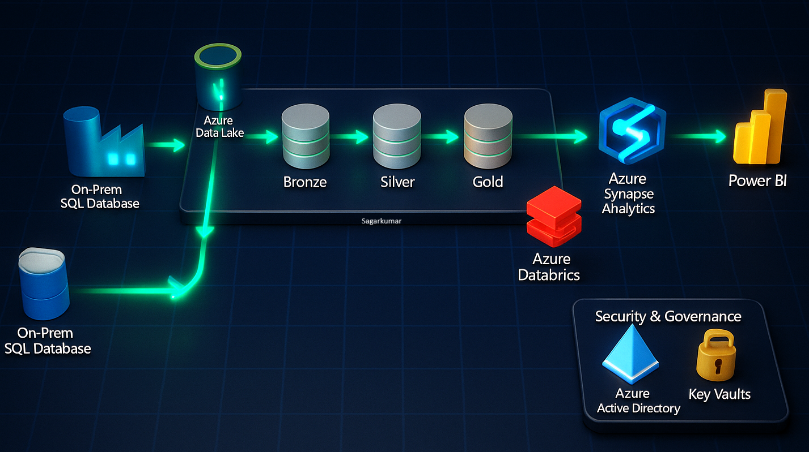

# Azure End-to-End Data Engineering Real-Time Project -- AdventureWorksData2022
This project is a data engineering pipeline solution to a made-up business problem, created to aid in my learning and understanding of data pipelining.

## Project Overview

This project addresses a critical business requirement by developing a comprehensive data pipeline leveraging Microsoft Azure services. The primary objective is to extract customer and sales data from an on-premises SQL database, perform data transformation processes within the cloud environment, and deliver actionable insights through a Power BI dashboard. The dashboard will present key performance indicators (KPIs) focused on gender distribution and product category sales, enabling stakeholders to filter and analyze the data by date, product category, and gender for informed decision-making.

## Business Requirements

The business has identified a critical gap in understanding customer demographics—particularly gender distribution—and its impact on purchasing behavior. To address this, the following key requirements have been established:

1. **Sales by Gender and Product Category**: Development of a dashboard that provides visibility into total products sold, overall sales revenue, and customer gender distribution across product categories.
2. **Data Filtering**: Implementation of interactive filters enabling users to refine the data based on product category, gender, and date range.
3. **User-Friendly Interface**: Delivery of an intuitive and accessible interface to ensure that stakeholders can effortlessly perform queries and derive insights without technical expertise.

## Solution Overview

To effectively meet the outlined business requirements, the proposed solution is structured into the following key components: 

1. **Data Ingestion**: 
    - Extract customer and sales data from the on-premises SQL database.
    - Ingest the extracted data into Azure Data Lake Storage (ADLS) using Azure Data Factory (ADF).

2. **Data Transformation**:
    - Utilize Azure Databricks to perform data cleaning and transformation tasks.
    - Structure the data using the Medallion Architecture:
        - Bronze Layer: Stores raw, unprocessed data.
        - Silver Layer: Contains cleansed and refined data.
        - Gold Layer: Holds aggregated, business-ready data for reporting and analytics.
        
3. **Data Loading and Reporting**:
    - Load the transformed Gold layer data into Azure Synapse Analytics for efficient querying.
    - Develop a Power BI dashboard to visualize key insights related to sales performance and customer demographics, with filtering capabilities by date, gender, and product category.

4. **Automation**:
    - Automate the entire pipeline using Azure Data Factory triggers and scheduling, ensuring the data and visualizations are refreshed daily for up-to-date decision-making.

## Technology Stack

- **Azure Data Factory (ADF)**: For orchestrating data movement and transformation.
- **Azure Data Lake Storage (ADLS)**: For storing raw and processed data.
- **Azure Databricks**: For data transformation and processing.
- **Azure Synapse Analytics**: For data warehousing and SQL-based analytics.
- **Power BI**: For data visualization and reporting.
- **Azure Key Vault**: For securely managing credentials and secrets.
- **SQL Server (On-Premises)**: Source of customer and sales data.

## Setup Instructions

### Prerequisites

- An Azure account with sufficient credits.
- Access to an on-premises SQL Server database environment.

### Step 1: Azure Environment Setup

1. **Create Resource Group**: Initialize a new resource group in the desired Azure region to organize and manage all related services.
2. **Provision Services**:
   - Deploy the following Azure resources:
     - Azure Data Factory for orchestrating data movement and transformation.
     - Azure Data Lake Storage (ADLS) with containers named bronze, silver, and gold to follow the Medallion Architecture.
     - Azure Databricks workspace for scalable data processing.
     - Azure Synapse Analytics workspace for data warehousing and reporting.
     - Azure Key Vault to securely store secrets, credentials, and keys.

### Step 2: Data Ingestion

1. **Set up SQL Server**: Install SQL Server and SQL Server Management Studio (SSMS). Restore the sample AdventureWorks database for demonstration and testing purposes.
2. **Ingest Data with ADF**: Develop data pipelines in Azure Data Factory to extract data from SQL Server. Load the raw data into the bronze container of ADLS.

### Step 3: Data Transformation

1. **Mount/Access Data Lake in Databricks**: Mount the Azure Data Lake Storage in Databricks to enable seamless access to ingested data.
2. **Transform and Structure Data**: Use Databricks notebooks to perform data cleaning, validation, and transformation. Move refined data sequentially from bronze → silver → gold layers following Medallion best practices.

### Step 4: Data Loading and Reporting

1. **Load Data into Synapse**: Set up a dedicated SQL pool in Azure Synapse Analytics. Ingest the gold layer data for optimized analytical querying.
2. **Create Power BI Dashboard**: Connect Power BI to the Synapse SQL pool. Create a dashboard that visualizes KPIs, including sales revenue, gender distribution, and product category performance, with interactive filtering options.

### Step 5: Automation and Monitoring

1. **Schedule Pipelines**: Use ADF triggers to automate daily execution of the data pipelines.
2. **Monitor Pipeline Runs**: Leverage monitoring features in ADF and Synapse to track execution status and troubleshoot failures.

### Step 6: Security and Governance

1. **Manage Access**: Configure user access using Azure Entra ID (formerly Azure Active Directory) to enforce least privilege access principles.

### Step 7: End-to-End Testing

1. **Trigger and Test Pipelines**: Add test records to the on-premises SQL database. Verify that the full pipeline—from ingestion to Power BI reporting—is triggered successfully and reflects the updates in near real-time.

## Conclusion

This project delivers a robust, end-to-end data solution designed to enhance the understanding of customer demographics and their influence on sales performance. By implementing a fully automated data pipeline, the solution ensures that stakeholders consistently have access to accurate, timely, and actionable insights to support data-driven decision-making.
